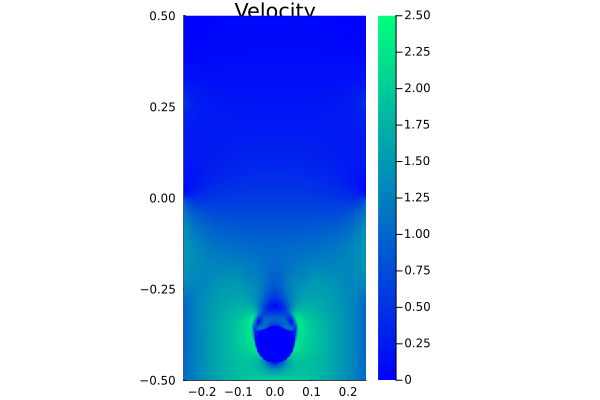
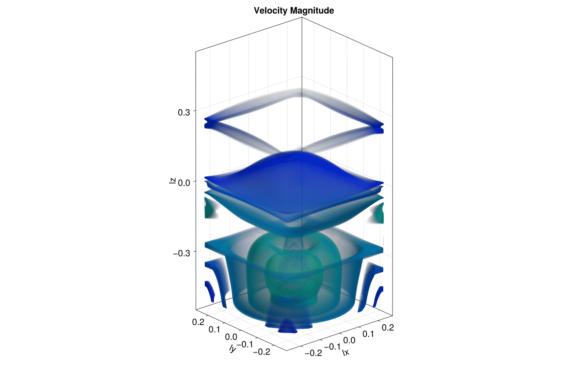
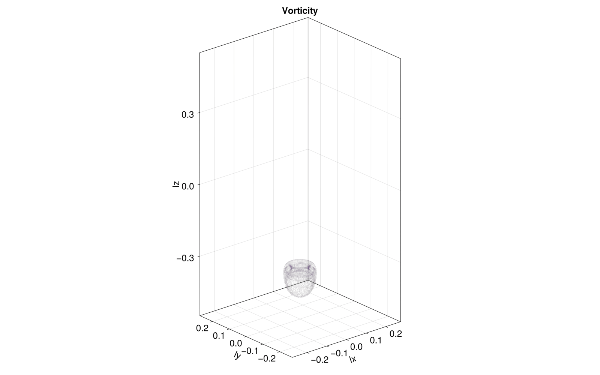
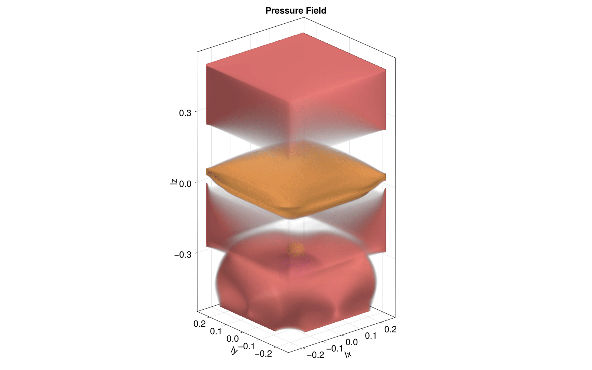

# Multi-xPU-3D-Navier-Stokes-Solver

[](https://github.com/BadeaTayea/Multi-xPU-3D-Navier-Stokes-Solver/actions/workflows/CI.yml)
[](https://github.com/BadeaTayea/Multi-xPU-3D-Navier-Stokes-Solver/actions/workflows/Literate.yml)
[](https://github.com/BadeaTayea/Multi-xPU-3D-Navier-Stokes-Solver/actions/workflows/Release.yml)

The project implements a **3D incompressible Navier-Stokes solver** in **Julia** using **ImplicitGlobalGrid.jl** and **ParallelStencil.jl**, enabling **multi-xPU parallelized execution** across distributed GPUs or multi-threaded CPUs. The solver models fluid flow around a spherical obstacle, governed by the incompressible Navier-Stokes equations. The simulation was tested on [**Piz Daint**](https://www.cscs.ch/computers/piz-daint/) multi-xPU nodes at the **Swiss National Supercomputing Centre (CSCS)** as part of the course **"Solving Partial Differential Equations in Parallel on Graphic Processing Units"** at **ETH Zürich**.

<table>
  <tr>
    <td align="center">
      <strong>Velocity Field</strong><br>
      
    </td>
    <td align="center">
      <strong>Vorticity Field</strong><br>
      
    </td>
    <td align="center">
      <strong>Pressure Field</strong><br>
      
    </td>
  </tr>
  <tr>
    <td align="center">
      <strong>Fig. 1:</strong> 2D Velocity Field - Evolution of velocity magnitude.
    </td>
    <td align="center">
      <strong>Fig. 2:</strong> 2D Vorticity Field - Evolution of rotational flow.
    </td>
    <td align="center">
      <strong>Fig. 3:</strong> 2D Pressure Field - Evolution of pressure distribution.
    </td>
  </tr>
</table>


<table>
  <tr>
    <td align="center">
      <strong>Velocity Field</strong><br>
      
    </td>
    <td align="center">
      <strong>Vorticity Field</strong><br>
      
    </td>
    <td align="center">
      <strong>Pressure Field</strong><br>
      
    </td>
  </tr>
  <tr>
    <td align="center">
      <strong>Fig. 4:</strong> 3D Velocity Field - Evolution of velocity magnitude.
    </td>
    <td align="center">
      <strong>Fig. 5:</strong> 3D Vorticity Field - Evolution of rotational flow structures.
    </td>
    <td align="center">
      <strong>Fig. 6:</strong> 3D Pressure Field - Evolution of pressure distribution in 3D.
    </td>
  </tr>
</table>

The flow of an incompressible fluid around a spherical obstacle is governed by the Navier-Stokes equations, which describe the conservation of momentum and enforce incompressibility:

$$
\rho \left( \frac{\partial \mathbf{V}}{\partial t} + (\mathbf{V} \cdot \nabla) \mathbf{V} \right) = -\nabla p + \mu \nabla^2 \mathbf{V},
$$

$$
\nabla \cdot \mathbf{V} = 0,
$$

where:
- $\mathbf{V} = [u, v, w]^T$ is the velocity vector field in the $x$, $y$, and $z$ directions,
- $p$ is the pressure field,
- $\rho$ is the fluid density,
- $\mu$ is the dynamic viscosity.


## Table of Contents

1. [Repository Guide](#repository-guide)  
2. [Setups](#setups)  
   - [Computational Setup](#computational-setup)  
   - [Visualization Setup](#visualization-setup)  
3. [Running Instructions](#running-instructions)  
4. [Physical Problem](#physical-problem)  
   - [Governing System of Partial Differential Equations (PDEs)](#governing-system-of-partial-differential-equations-pdes)  
   - [Boundary Conditions](#boundary-conditions)  
5. [Numerical Methods and Implementation](#numerical-methods-and-implementation)  
   - [Intermediate Velocity Update](#intermediate-velocity-update)  
   - [Convective Term and Semi-Lagrangian Advection](#convective-term-and-semi-lagrangian-advection)  
   - [Divergence Calculation and Incompressibility Enforcement](#divergence-calculation-and-incompressibility-enforcement)  
   - [Pressure Correction and Velocity Divergence-Free Constraint](#pressure-correction-and-velocity-divergence-free-constraint)  
   - [Boundary Conditions](#boundary-conditions)  
   - [Stability and Numerical Resolution](#stability-and-numerical-resolution)  
6. [xPU Computing](#xpu-computing)  
   - [Single-xPU Implementation](#single-xpu-implementation)  
   - [Multi-xPU Implementation](#multi-xpu-implementation)  
7. [Visualization: Velocity, Vorticity, and Pressure Fields](#visualization-velocity-vorticity-and-pressure-fields)  
   - [Cross-Sectional Evolution in 2D](#cross-sectional-evolution-in-2d)  
   - [Evolution in 3D](#evolution-in-3d)  
8. [Resources](#resources)  


## Repository Guide

```bash
.
├── deps
│   └── build.jl
├── docs
│   ├── 2D_Pressure_Animation.gif
│   ├── 2D_Velocity_Animation.gif
│   ├── 2D_Vorticity_Animation.gif
│   ├── 3D_Pressure_Animation.gif
│   ├── 3D_Velocity_Animation.gif
│   ├── 3D_Vorticity_Animation.gif
│   └── md
│       └── Literate.md
│       └── numerical_methods.md
├── Project.toml
├── README.md
├── scripts
│   ├── Literate.jl
│   ├── NavierStokes3D_multixpu.jl
│   ├── NavierStokes3D_xpu.jl
│   ├── Project.toml
│   ├── run_multixpu.sh
│   ├── run_xpu.sh
│   └── visualization
│       ├── NavierStokes_2D_Viz.jl
│       └── NavierStokes_3D_Viz.jl
└── test
    ├── NavierStokes3D_multixpu_testing.jl
    ├── out
    │   ├── A_out.bin
    │   ├── out_Pr_10.bin
    │   ├── out_Vx_10.bin
    │   ├── out_Vy_10.bin
    │   └── out_Vz_10.bin
    ├── out_ground_truth
    │   ├── out_Pr_10.bin
    │   ├── out_Vx_10.bin
    │   ├── out_Vy_10.bin
    │   └── out_Vz_10.bin
    ├── Project.toml
    └── runtests.jl
```

## Setups
All computations for this project were conducted on the supercomputer **Piz Daint** at CSCS. Piz Daint comprises approximately 5,700 compute nodes, each equipped with an Nvidia P100 GPU (16GB PCIe). To ensure a seamless workflow for computation and visualization, a few preparatory measures were implemented. Details are outlined below:

### Computational Setup
To run Julia interactively on Piz Daint, the following steps were followed:

1. Access Daint using the terminal:
```bash
$ ssh daint-xc
```

2. Allocate the desired configuration (xPU, nodes, processes, time) via SLURM:
```bash
$ salloc -C'gpu' -Aclass04 -N1 -n1 --time=01:00:00
```

3. Access Compute node:
```bash
$ . $SCRATCH/../julia/daint-gpu-nocudaaware/activate
```


4. Activate a previously prepared Julia configuration:
```bash
$ juliaup
```

### Visualization Setup

Visualization scripts rely on GLMakie. GLMakie requires OpenGL, which is unavailable in headless environments such as Piz Daint. As a walk-through, we set up a virtual display for headless rendering on Piz Daint, and then added the packages and ran the scripts. Here's a quick summary of the scheme used to create run visualization scripts:

1. Set up a virtual display for headless rendering on Piz Daint:
```bash
$ Xvfb :1 -screen 0 1024x768x24 &
$ export DISPLAY=:1
```

2. Confirm that Xvfb is running using:
```bash
$ ps aux | grep Xvfb
class203 12856  0.0  0.0 2389004 43516 pts/0   Sl   10:00   0:00 Xvfb :1 -screen 0 1024x768x24
```

3. Enter julia REPL and activate a local project:
```julia
julia> using Pkg
julia> Pkg.activate()
julia> Pkg.instantiate()
```

4. Re-install the GLMakie package within the environment:
  ```julia
  Pkg.add("GLMakie")
  ```
  
5. Run the script relying on GLMakie (e.g. `./scripts/visualization/NavierStokes_3D_Viz.jl`):
```julia
julia> include("NavierStokes_3D_Viz.jl")
```


### Running Instructions:

#### Using Single xPU's
To launch the simulation on a single xPU:

1. Run the batch script `./scripts/run_xpu.sh`
```bash
sbatch run_xpu.sh
```
This will generate output inside a new written directory `./scripts/navier_stokes_3d_xpu_sphere_outputs`.

2. To visualize the results, run `./scripts/visualization/NavierStokes_2D_Viz.jl`:
```julia
julia> include("NavierStokes_2D_Viz.jl")
```
This will generate 2D frames and an animation for the evolution of each of velocity, vorticity, and pressure in separate directories. 

#### Using Multiple xPU's
To launch the simulation on multiple xPU's:

1. Run the batch script `./scripts/run_multixpu.sh`
```bash
sbatch run_multixpu.sh
```
This will generate output inside a new written directory `./scripts/navier_stokes_3d_multixpu_sphere_outputs`.

2. To visualize the results, run `./scripts/visualization/NavierStokes_3D_Viz.jl`:
```julia
julia> include("NavierStokes_3D_Viz.jl")
```
For this step, make sure to follow the instructions under the "Visualization Setup" section.
This will generate 3D frames and an animation for the evolution of each of velocity, vorticity, and pressure in separate directories. 


## Physical Problem 

### Governing System of Partial Differential Equations (PDEs)

The flow of an incompressible fluid around a spherical obstacle is governed by the Navier-Stokes equations, which describe the conservation of momentum and enforce incompressibility:

$$
\rho \left( \frac{\partial \mathbf{V}}{\partial t} + (\mathbf{V} \cdot \nabla) \mathbf{V} \right) = -\nabla p + \mu \nabla^2 \mathbf{V},
$$

$$
\nabla \cdot \mathbf{V} = 0,
$$

where:
- $\mathbf{V} = [u, v, w]^T$ is the velocity vector field in the $x$, $y$, and $z$ directions,
- $p$ is the pressure field,
- $\rho$ is the fluid density,
- $\mu$ is the dynamic viscosity.

The velocity field $\mathbf{V}$ must satisfy a variety of physical constraints. At the sphere's surface, the velocity is set to zero, enforcing the no-slip condition and ensuring that fluid adheres to the obstacle. Away from the sphere, the velocity evolves dynamically according to the Navier-Stokes equations. The inlet velocity is imposed with a parabolic profile, setting the initial conditions for flow entering the domain. This profile aligns with the assumption of laminar inflow and ensures smooth flow entry.

Pressure $p$, on the other hand, plays a crucial role in maintaining the incompressibility condition, $\nabla \cdot \mathbf{V} = 0$. The pressure field acts as a correction mechanism, dynamically adjusting to counteract any divergence in the velocity field. This adjustment is achieved by solving the pressure Poisson equation:

$$
\nabla^2 p = \frac{\rho}{\Delta t} \nabla \cdot \mathbf{V},
$$

where $\Delta t$ is the simulation time step.

The flow characteristics are largely determined by the Reynolds number, a dimensionless parameter defined as:

$$
Re = \frac{\rho V_{in} L}{\mu},
$$

Here, $V_{in}$ represents the characteristic inlet velocity, and $L$ is the characteristic length (domain size or obstacle diameter). For $Re = 10^6$, the flow regime is dominated by inertial forces, with viscous effects localized near the obstacle's boundary.

Rotational aspects of the flow are characterized by the vorticity field, which can be derived from the velocity field as the curl:

$$
\boldsymbol{\omega} = \nabla \times \mathbf{V},
$$

with components:

$$
\omega_x = \frac{\partial w}{\partial y} - \frac{\partial v}{\partial z}, \quad \omega_y = \frac{\partial u}{\partial z} - \frac{\partial w}{\partial x}, \quad \omega_z = \frac{\partial v}{\partial x} - \frac{\partial u}{\partial y}.
$$

The magnitude of vorticity is expressed as:

$$
|\omega| = \sqrt{\omega_x^2 + \omega_y^2 + \omega_z^2}.
$$

The vorticity magnitude is essential for visualizing and analyzing vortex structures, such as those formed in the wake of the sphere.


### Boundary Conditions

Boundary conditions define the flow behavior at the domain boundaries and the surface of the sphere. At the sphere's surface, the no-slip condition is enforced:

$$
\mathbf{V} = 0, \quad \forall \mathbf{x} \, \text{s.t.} \, \frac{(x - x_s)^2}{r^2} + \frac{(y - y_s)^2}{r^2} + \frac{(z - z_s)^2}{r^2} \leq 1,
$$

where $(x_s, y_s, z_s)$ is the sphere's center, and $r$ is its radius. This ensures that the fluid adheres to the sphere's surface, creating shear layers and wake dynamics.

At the inlet boundary ($z = 0$), a parabolic velocity profile is imposed for $w$:

$$
w(x, y, z=0) = 4 V_{in} \frac{x}{L_x} \left(1 - \frac{x}{L_x} \right) \frac{y}{L_y} \left(1 - \frac{y}{L_y} \right),
$$

where $L_x$ and $L_y$ are the domain dimensions in the $x$ and $y$ directions. This smooth inflow profile simulates laminar flow entering the domain.

At the outlet boundary ($z = L_z$), a zero-gradient Neumann condition is applied to pressure:

$$
\frac{\partial p}{\partial z} = 0,
$$

allowing the flow to exit without resistance. On the side walls, free-slip boundary conditions are applied to minimize interactions with the domain boundaries. For the tangential components, these conditions ensure:

$$
\frac{\partial u}{\partial y} = 0, \, v = 0, \, \frac{\partial w}{\partial x} = 0,
$$

on the YZ plane, and similarly for the XZ plane. These conditions prevent the generation of artificial shear forces along the walls.


## Numerical Methods and Implementation

The numerical solution of the incompressible Navier-Stokes equations is performed using **Chorin's projection method**, which splits the velocity update into separate steps handling **viscous, gravitational, convective, and pressure-driven effects**. The solver integrates:
- **Explicit Euler time-stepping** for the intermediate velocity update.
- **Semi-Lagrangian advection** for convective transport.
- **A pseudo-transient pressure solver** to enforce incompressibility.

### Intermediate Velocity Update

The intermediate velocity $\mathbf{V}^*$ is calculated by incorporating viscous and gravitational forces using explicit Euler time-stepping:

$$
\frac{\mathbf{V}^* - \mathbf{V}^n}{\Delta t} = \mu \nabla^2 \mathbf{V}^n - \rho \mathbf{g},
$$

where $\mathbf{g}$ is the gravitational acceleration. This update is implemented in the `predict_V!` function, which updates the velocity components `Vx`, `Vy`, and `Vz` in place:

```julia
@parallel function predict_V!(Vx, Vy, Vz, τxx, τyy, τzz, τxy, τxz, τyz, ρ, g, dt, dx, dy, dz)
    @inn(Vx) = @inn(Vx) + dt/ρ * (@d_xi(τxx)/dx + @d_ya(τxy)/dy + @d_za(τxz)/dz)
    @inn(Vy) = @inn(Vy) + dt/ρ * (@d_yi(τyy)/dy + @d_xa(τxy)/dx + @d_za(τyz)/dz)
    @inn(Vz) = @inn(Vz) + dt/ρ * (@d_zi(τzz)/dz + @d_xa(τxz)/dx + @d_ya(τyz)/dy - ρ*g)
end
```

The function utilizes stress tensor components (`τxx`, `τyy`, `τzz`, etc.), computed in `update_τ!`, to represent the viscous forces:

$$
\tau_{ij} = \mu \left( \frac{\partial u_i}{\partial x_j} + \frac{\partial u_j}{\partial x_i} \right) - \frac{2}{3} \mu (\nabla \cdot \mathbf{V}) \delta_{ij}.
$$

These components are calculated using finite-difference operators (`@d_xa`, `@d_ya`, `@d_za`) over the velocity arrays, and the gravitational term is added explicitly:

```julia
@parallel function update_τ!(τxx, τyy, τzz, τxy, τxz, τyz, Vx, Vy, Vz, μ, dx, dy, dz)
    @all(τxx) = 2μ * (@d_xa(Vx)/dx - @∇V()/3.0)  
    @all(τyy) = 2μ * (@d_ya(Vy)/dy - @∇V()/3.0)
    @all(τzz) = 2μ * (@d_za(Vz)/dz - @∇V()/3.0)
    @all(τxy) =  μ * (@d_yi(Vx)/dy + @d_xi(Vy)/dx)
    @all(τxz) =  μ * (@d_zi(Vx)/dz + @d_xi(Vz)/dx)
    @all(τyz) =  μ * (@d_zi(Vy)/dz + @d_yi(Vz)/dy)
end
```


### Divergence Calculation and Incompressibility Enforcement
A key requirement for solving incompressible flows is enforcing the **zero divergence constraint**:

$$
\nabla \cdot \mathbf{V} = 0.
$$

Before solving the pressure Poisson equation, the solver first computes the **velocity divergence** $\nabla \cdot \mathbf{V}^*$, which is stored in the array `∇V`. This step is implemented in `update_∇V!`:

```julia
@parallel function update_∇V!(∇V, Vx, Vy, Vz, dx, dy, dz)
    @all(∇V) = @d_xa(Vx)/dx + @d_ya(Vy)/dy + @d_za(Vz)/dz
end
```
- **Finite-difference operators** (`@d_xa`, `@d_ya`, `@d_za`) compute the divergence in the respective spatial directions.
- The divergence is stored in `∇V`, which is later used in the **pressure correction step**.

By evaluating `∇V` before solving for pressure, the solver ensures that corrections applied to velocity eliminate divergence, enforcing incompressibility.


### Convective Term and Semi-Lagrangian Advection

The convective term, responsible for momentum transport due to the flow, is handled using a **semi-Lagrangian approach**. Instead of solving the advection term explicitly, this method traces fluid parcels backward in time and interpolates their values:

$$
\mathbf{X}_{\text{backtracked}} = \mathbf{X} - \mathbf{V} \Delta t.
$$

where $\mathbf{X}_{\text{backtracked}}$ is the estimated position of a parcel. The backtracking and interpolation process is implemented in `advect!` by calling `backtrack!`, which:
1. Computes the source position** using velocity at the grid point.
2. Interpolates values from the nearest neighbors using `lerp`.

```julia
@inline function backtrack!(A, A_o, vxc, vyc, vzc, dt, dx, dy, dz, ix, iy, iz)
    δx, δy, δz = dt * vxc / dx, dt * vyc / dy, dt * vzc / dz
    ix1 = clamp(floor(Int, ix - δx), 1, size(A,1))
    iy1 = clamp(floor(Int, iy - δy), 1, size(A,2))
    iz1 = clamp(floor(Int, iz - δz), 1, size(A,3))
    A[ix, iy, iz] = lerp(A_o[ix1, iy1, iz1], A_o[ix1+1, iy1+1, iz1+1], δx)
end
```

For each velocity component (`Vx`, `Vy`, `Vz`), this interpolation is applied **along the flow direction**:

```julia
@parallel_indices (ix, iy, iz) function advect!(Vx, Vx_o, Vy, Vy_o, Vz, Vz_o, C, C_o, dt, dx, dy, dz)
    if ix > 1 && ix < size(Vx,1)
        vxc = Vx_o[ix, iy, iz]
        vyc = 0.25 * (Vy_o[ix-1, iy, iz] + Vy_o[ix-1, iy+1, iz] + Vy_o[ix, iy, iz] + Vy_o[ix, iy+1, iz])
        vzc = 0.25 * (Vz_o[ix-1, iy, iz] + Vz_o[ix-1, iy, iz+1] + Vz_o[ix, iy, iz] + Vz_o[ix, iy, iz+1])
        backtrack!(Vx, Vx_o, vxc, vyc, vzc, dt, dx, dy, dz, ix, iy, iz)
    end
end
```

### Pressure Correction and Velocity Divergence-Free Constraint

To ensure incompressibility, the velocity field is corrected using the pressure gradient:

$$
\frac{\mathbf{V}^{n+1} - \mathbf{V}^*}{\Delta t} = -\frac{1}{\rho} \nabla p^{n+1}.
$$

The correction step is implemented in the `correct_V!` function, which updates the velocity fields `Vx`, `Vy`, and `Vz` using finite-difference operators (`@d_xi`, `@d_yi`, `@d_zi`) applied to the pressure array `Pr`: 

```julia
@parallel function correct_V!(Vx, Vy, Vz, Pr, dt, ρ, dx, dy, dz)
    @inn(Vx) = @inn(Vx) - dt/ρ * @d_xi(Pr)/dx
    @inn(Vy) = @inn(Vy) - dt/ρ * @d_yi(Pr)/dy
    @inn(Vz) = @inn(Vz) - dt/ρ * @d_zi(Pr)/dz
end
```
The pressure gradient enforces the divergence-free condition, ensuring mass conservation.

The pressure at iteration $(n+1)$ is obtained by solving the Poisson equation:

$$
\nabla^2 p^{n+1} = \frac{\rho}{\Delta t} \nabla \cdot \mathbf{V}^*.
$$

This equation is solved iteratively using a pseudo-transient approach. The divergence of the velocity field is first calculated in `update_∇V!`, and the pseudo-time derivative of pressure is computed in `update_dPrdτ!`. The pressure is then updated in `update_Pr!` until convergence:

```julia
@parallel function update_Pr!(Pr, dPrdτ, dτ)
    @inn(Pr) = @inn(Pr) + dτ * @all(dPrdτ)
end
```

### Boundary Conditions

Boundary conditions are enforced for both velocity and pressure fields at each timestep. The function `set_bc_Vel!` applies boundary conditions for `Vx`, `Vy`, and `Vz`. For example:
- The inlet boundary (`z = 0`) is set with a parabolic velocity profile stored in `Vprof` (implemented via `bc_zV!`):

$$ 
w(x, y, z = 0) = 4 V_{in} \frac{x}{L_x} \left(1 - \frac{x}{L_x} \right) \frac{y}{L_y} \left(1 - \frac{y}{L_y} \right).
$$

Implemented in `bc_zV!`:

```julia
@parallel_indices (ix, iy) function bc_zV!(A, V)
    A[ix, iy, 1] = V[ix, iy]
end
```
  
- No-slip conditions at the sphere surface are applied in `set_sphere_multixpu!`, which zeroes the velocity components `Vx`, `Vy`, and `Vz` inside and on the surface of the sphere:

```julia
@parallel_indices (ix, iy, iz) function set_sphere_multixpu!(C, Vx, Vy, Vz, ox, oy, oz, lx, ly, lz, dx, dy, dz, r2)
    if (xc - ox)^2 + (yc - oy)^2 + (zc - oz)^2 < r2
        Vx[ix, iy, iz] = 0.0
        Vy[ix, iy, iz] = 0.0
        Vz[ix, iy, iz] = 0.0
    end
end
```
- Free-slip boundary conditions for velocity and zero-gradient Neumann conditions for pressure are enforced on side walls using functions like `bc_xz!`, `bc_yz!`, and `bc_xy!`.

Pressure boundary conditions are imposed via `set_bc_Pr!`. For instance, a Dirichlet condition sets `Pr = 0` at the outlet, while zero-gradient Neumann conditions are applied elsewhere.

### Stability and Numerical Resolution

Stability is maintained by constraining the timestep $\Delta t$ based on viscous and advective criteria:

$$
\Delta t = \min \left( \frac{\rho \Delta z^2}{\mu}, \frac{\Delta z}{V_{in}} \right),
$$

where $\Delta z$ is the grid spacing. This ensures accurate resolution of both small-scale viscous interactions and large-scale advection dynamics. 


## xPU Computing

### Single-xPU Implementation

The single-xPU implementation runs entirely on a single GPU or a multi-threaded CPU. The computational domain is represented as a set of arrays, such as `Vx`, `Vy`, `Vz` for velocity components, and `Pr` for pressure. All operations, including boundary condition enforcement (e.g., `set_bc_Vel!` for velocity and `set_bc_Pr!` for pressure), stress tensor updates (`update_τ!`), and semi-Lagrangian advection (`advect!`), are performed in this single domain without involving inter-node communication. The data arrays are updated iteratively using parallel kernels defined with `ParallelStencil`. Intermediate and final results, including velocity and pressure fields, are directly saved using functions like `save_array` to a local output directory.

### Multi-xPU Implementation

The **multi-xPU implementation** distributes the computational domain across multiple xPUs using `ImplicitGlobalGrid`. Each xPU (GPU or CPU thread) operates on a subdomain, with velocity (`Vx`, `Vy`, `Vz`) and pressure (`Pr`) arrays split among processes. To maintain continuity at subdomain interfaces, **halo exchanges** (`update_halo!`) are performed after each computational step. This allows inter-process communication while maintaining local stencil computations.

```julia
me, dims, nprocs, coords = init_global_grid(nx, ny, nz)
update_halo!(Vx, Vy, Vz)
```

Operations like enforcing **no-slip conditions** for the sphere (`set_sphere_multixpu!`) use **global coordinates** to ensure correctness across subdomains. A global reduction operation, `max_g`, aggregates results (e.g., residual errors) across all xPUs to monitor convergence.

```julia
@parallel function set_sphere_multixpu!(C, Vx, Vy, Vz, ox, oy, oz, lx, ly, lz, dx, dy, dz, r2, nx, ny, nz, coords)
    xc, yc, zc = (coords[1] * (nx - 2) + (ix - 1)) * dx + dx/2 - lx/2, (coords[2] * (ny - 2) + (iy - 1)) * dy + dy/2 - ly/2, (coords[3] * (nz - 2) + (iz - 1)) * dz + dz/2 - lz/2
    if (xc - ox)^2 / r2 + (yc - oy)^2 / r2 + (zc - oz)^2 / r2 < 1.0
        Vx[ix, iy, iz] = 0.0
        Vy[ix, iy, iz] = 0.0
        Vz[ix, iy, iz] = 0.0
    end
end
```

Results are **gathered** from all xPUs for post-processing using `gather!`, ensuring that a complete global solution is available for visualization or storage.

```julia
Pr_inn .= Array(Pr[2:end-1, 2:end-1, 2:end-1]); gather!(Pr_inn, Pr_v)
Vx_inn .= Array(avx(Vx)[2:end-1, 2:end-1, 2:end-1]); gather!(Vx_inn, Vx_v)
Vy_inn .= Array(avy(Vy)[2:end-1, 2:end-1, 2:end-1]); gather!(Vy_inn, Vy_v)
Vz_inn .= Array(avz(Vz)[2:end-1, 2:end-1, 2:end-1]); gather!(Vz_inn, Vz_v)
```

## Visualization: Velocity, Vorticity, and Pressure Fields

### Cross-Sectional Evolution of Velocity, Vorticity, and Pressure Fields in 2D 

<table>
  <tr>
    <td align="center">
      <strong>Velocity Field</strong><br>
      
    </td>
    <td align="center">
      <strong>Vorticity Field</strong><br>
      
    </td>
    <td align="center">
      <strong>Pressure Field</strong><br>
      
    </td>
  </tr>
  <tr>
    <td align="center">
      <strong>Fig. 1:</strong> 2D Velocity Field - Evolution of velocity magnitude.
    </td>
    <td align="center">
      <strong>Fig. 2:</strong> 2D Vorticity Field - Evolution of rotational flow.
    </td>
    <td align="center">
      <strong>Fig. 3:</strong> 2D Pressure Field - Evolution of pressure distribution.
    </td>
  </tr>
</table>

### Evolution of Velocity, Vorticity, and Pressure Fields in 3D 

<table>
  <tr>
    <td align="center">
      <strong>Velocity Field</strong><br>
      
    </td>
    <td align="center">
      <strong>Vorticity Field</strong><br>
      
    </td>
    <td align="center">
      <strong>Pressure Field</strong><br>
      
    </td>
  </tr>
  <tr>
    <td align="center">
      <strong>Fig. 4:</strong> 3D Velocity Field - Evolution of velocity magnitude.
    </td>
    <td align="center">
      <strong>Fig. 5:</strong> 3D Vorticity Field - Evolution of rotational flow structures.
    </td>
    <td align="center">
      <strong>Fig. 6:</strong> 3D Pressure Field - Evolution of pressure distribution in 3D.
    </td>
  </tr>
</table>

## Resources
- [NavierStokes.jl](https://github.com/utkinis/NavierStokes.jl)
- [Solving the Incompressible
Navier-Stokes Equations in 3-D
to Model Gas Flow in a Room](https://uu.diva-portal.org/smash/get/diva2:1843814/FULLTEXT01.pdf)
- [Navier Stokes Equations in 3D](https://www.grc.nasa.gov/www/k-12/airplane/nseqs.html)

