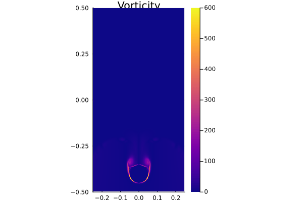

# Multi-xPU-3D-Navier-Stokes-Solver

[](https://github.com/BadeaTayea/Multi-xPU-3D-Navier-Stokes-Solver/actions/workflows/CI.yml)

[](https://github.com/BadeaTayea/Multi-xPU-3D-Navier-Stokes-Solver/actions/workflows/Literate.yml)


## Repository Guide

```bash
.
├── deps
│   └── build.jl
├── docs
│   ├── 2D_Pressure_Animation.gif
│   ├── 2D_Velocity_Animation.gif
│   ├── 2D_Vorticity_Animation.gif
│   ├── 3D_Pressure_Animation.gif
│   ├── 3D_Velocity_Animation.gif
│   ├── 3D_Vorticity_Animation.gif
│   └── md
│       └── Literate.md
│       └── numerical_methods.md
├── Project.toml
├── README.md
├── scripts
│   ├── Literate.jl
│   ├── NavierStokes3D_multixpu.jl
│   ├── NavierStokes3D_xpu.jl
│   ├── Project.toml
│   ├── run_multixpu.sh
│   ├── run_xpu.sh
│   └── visualization
│       ├── NavierStokes_2D_Viz.jl
│       └── NavierStokes_3D_Viz.jl
└── test
    ├── NavierStokes3D_multixpu_testing.jl
    ├── out
    │   ├── A_out.bin
    │   ├── out_Pr_10.bin
    │   ├── out_Vx_10.bin
    │   ├── out_Vy_10.bin
    │   └── out_Vz_10.bin
    ├── out_ground_truth
    │   ├── out_Pr_10.bin
    │   ├── out_Vx_10.bin
    │   ├── out_Vy_10.bin
    │   └── out_Vz_10.bin
    ├── Project.toml
    └── runtests.jl
```

## Setups
All computations for this project were conducted on the supercomputer **Piz Daint** at CSCS. Piz Daint comprises approximately 5,700 compute nodes, each equipped with an Nvidia P100 GPU (16GB PCIe). To ensure a seamless workflow for computation and visualization, a few preparatory measures were implemented. Details are outlined below:

### Computational Setup
To run Julia interactively on Piz Daint, the following steps were followed:

1. Access Daint using the termina
```bash
$ ssh daint-xc
```

2. Allocate the desired configuration (xPU, nodes, processes, time) via SLURM:
```bash
$ salloc -C'gpu' -Aclass04 -N1 -n1 --time=01:00:00
```

3. Access Compute node:
```bash
$ . $SCRATCH/../julia/daint-gpu-nocudaaware/activate
```


4. Activate a previously prepared Julia configuration:
```bash
$ juliaup
```

### Visualization Setup

Visualization scripts rely on GLMakie. GLMakie requires OpenGL, which is unavailable in headless environments such as Piz Daint. As a walk-through, we set up a virtual display for headless rendering on Piz Daint, and then added the packages and ran the scripts. Here's a quick summary of the scheme used to create run visualization scripts:

1. Set up a virtual display for headless rendering on Piz Daint:
```bash
$ Xvfb :1 -screen 0 1024x768x24 &
$ export DISPLAY=:1
```

2. Confirm that Xvfb is running using:
```bash
$ ps aux | grep Xvfb
class203 12856  0.0  0.0 2389004 43516 pts/0   Sl   10:00   0:00 Xvfb :1 -screen 0 1024x768x24
```

3. Enter julia REPL and activate a local project:
```julia
julia> using Pkg
julia> Pkg.activate()
julia> Pkg.instantiate()
```

4. Re-install the GLMakie package within the environment:
  ```julia
  Pkg.add("GLMakie")
  ```
  
5. Run the script relying on GLMakie (e.g. `./scripts/visualization/NavierStokes_3D_Viz.jl`):
```julia
julia> include("NavierStokes_3D_Viz.jl")
```

## Physical Problem 

### Governing System of Partial Differential Equations (PDEs)

The flow of an incompressible fluid around a spherical obstacle is governed by the Navier-Stokes equations, which describe the conservation of momentum and enforce incompressibility:

$$
\rho \left( \frac{\partial \mathbf{V}}{\partial t} + (\mathbf{V} \cdot \nabla) \mathbf{V} \right) = -\nabla p + \mu \nabla^2 \mathbf{V},
$$

$$
\nabla \cdot \mathbf{V} = 0,
$$

where:
- $\mathbf{V} = [u, v, w]^T$ is the velocity vector field in the $x$, $y$, and $z$ directions,
- $p$ is the pressure field,
- $\rho$ is the fluid density,
- $\mu$ is the dynamic viscosity.

The velocity field $\mathbf{V}$ must satisfy a variety of physical constraints. At the sphere's surface, the velocity is set to zero, enforcing the no-slip condition and ensuring that fluid adheres to the obstacle. Away from the sphere, the velocity evolves dynamically according to the Navier-Stokes equations. The inlet velocity is imposed with a parabolic profile, setting the initial conditions for flow entering the domain. This profile aligns with the assumption of laminar inflow and ensures smooth flow entry.

Pressure $p$, on the other hand, plays a crucial role in maintaining the incompressibility condition, $\nabla \cdot \mathbf{V} = 0$. The pressure field acts as a correction mechanism, dynamically adjusting to counteract any divergence in the velocity field. This adjustment is achieved by solving the pressure Poisson equation:

$$
\nabla^2 p = \frac{\rho}{\Delta t} \nabla \cdot \mathbf{V},
$$

where $\Delta t$ is the simulation time step.

The flow characteristics are largely determined by the Reynolds number, a dimensionless parameter defined as:

$$
Re = \frac{\rho V_{in} L}{\mu},
$$

Here, $V_{in}$ represents the characteristic inlet velocity, and $L$ is the characteristic length (domain size or obstacle diameter). For $Re = 10^6$, the flow regime is dominated by inertial forces, with viscous effects localized near the obstacle's boundary.

Rotational aspects of the flow are characterized by the vorticity field, which can be derived from the velocity field as the curl:

$$
\boldsymbol{\omega} = \nabla \times \mathbf{V},
$$

with components:

$$
\omega_x = \frac{\partial w}{\partial y} - \frac{\partial v}{\partial z}, \quad \omega_y = \frac{\partial u}{\partial z} - \frac{\partial w}{\partial x}, \quad \omega_z = \frac{\partial v}{\partial x} - \frac{\partial u}{\partial y}.
$$

The magnitude of vorticity is expressed as:

$$
|\omega| = \sqrt{\omega_x^2 + \omega_y^2 + \omega_z^2}.
$$

The vorticity magnitude is essential for visualizing and analyzing vortex structures, such as those formed in the wake of the sphere.


### Boundary Conditions

Boundary conditions define the flow behavior at the domain boundaries and the surface of the sphere. At the sphere's surface, the no-slip condition is enforced:

$$
\mathbf{V} = 0, \quad \forall \mathbf{x} \, \text{s.t.} \, \frac{(x - x_s)^2}{r^2} + \frac{(y - y_s)^2}{r^2} + \frac{(z - z_s)^2}{r^2} \leq 1,
$$

where $(x_s, y_s, z_s)$ is the sphere's center, and $r$ is its radius. This ensures that the fluid adheres to the sphere's surface, creating shear layers and wake dynamics.

At the inlet boundary ($z = 0$), a parabolic velocity profile is imposed for $w$:

$$
w(x, y, z=0) = 4 V_{in} \frac{x}{L_x} \left(1 - \frac{x}{L_x} \right) \frac{y}{L_y} \left(1 - \frac{y}{L_y} \right),
$$

where $L_x$ and $L_y$ are the domain dimensions in the $x$ and $y$ directions. This smooth inflow profile simulates laminar flow entering the domain.

At the outlet boundary ($z = L_z$), a zero-gradient Neumann condition is applied to pressure:

$$
\frac{\partial p}{\partial z} = 0,
$$

allowing the flow to exit without resistance. On the side walls, free-slip boundary conditions are applied to minimize interactions with the domain boundaries. For the tangential components, these conditions ensure:

$$
\frac{\partial u}{\partial y} = 0, \, v = 0, \, \frac{\partial w}{\partial x} = 0,
$$

on the YZ plane, and similarly for the XZ plane. These conditions prevent the generation of artificial shear forces along the walls.


### Numerical Methods and Implementation
The numerical solution of the incompressible Navier-Stokes equations is performed using Chorin's projection method, an operator-splitting approach. This method separates the velocity update into components corresponding to the physical terms in the equations—viscous, gravitational, convective, and pressure-driven effects. The scripts integrate multiple numerical strategies, including explicit Euler time-stepping, semi-Lagrangian advection, and a pseudo-transient pressure solver, to ensure efficient and stable computations.

For a detailed discussion, check out the markdown document here: [Numerical Methods](docs/md/numerical_methods.md)


## xPU Computing

### Single-xPU Implementation

The single-xPU implementation runs entirely on a single GPU or a multi-threaded CPU. The computational domain is represented as a set of arrays, such as `Vx`, `Vy`, `Vz` for velocity components, and `Pr` for pressure. All operations, including boundary condition enforcement (e.g., `set_bc_Vel!` for velocity and `set_bc_Pr!` for pressure), stress tensor updates (`update_τ!`), and semi-Lagrangian advection (`advect!`), are performed in this single domain without involving inter-node communication. The data arrays are updated iteratively using parallel kernels defined with `ParallelStencil`. Intermediate and final results, including velocity and pressure fields, are directly saved using functions like `save_array` to a local output directory.

### Multi-xPU Implementation

The multi-xPU implementation partitions the computational domain across multiple xPUs using `ImplicitGlobalGrid`. Each xPU operates on its assigned subdomain, with arrays such as `Vx`, `Vy`, `Vz`, and `Pr` distributed across all processes. Communication between subdomains is handled explicitly using halo updates (`update_halo!`), ensuring continuity at subdomain boundaries. Specific operations, such as enforcing the no-slip boundary condition for the sphere (`set_sphere_multixpu!`), account for the distributed nature of the domain by referencing global coordinates. Functions like `max_g` aggregate data globally, ensuring that results such as residual errors or boundary conditions are synchronized across all processes. `MPI` is used to enable scalability, allowing large domains to be solved efficiently by distributing both the computation and memory requirements. Results are gathered from all xPUs for saving or post-processing.


## Visualization: Velocity, Vorticity, and Pressure Fields

### Cross-Sectional Evolution in 2D 

<table>
  <tr>
    <td align="center">
      <strong>Velocity Field</strong><br>
      
    </td>
    <td align="center">
      <strong>Vorticity Field</strong><br>
      
    </td>
    <td align="center">
      <strong>Pressure Field</strong><br>
      
    </td>
  </tr>
  <tr>
    <td align="center">
      <strong>Fig. 1:</strong> 2D Velocity Field - Evolution of velocity magnitude.
    </td>
    <td align="center">
      <strong>Fig. 2:</strong> 2D Vorticity Field - Evolution of rotational flow.
    </td>
    <td align="center">
      <strong>Fig. 3:</strong> 2D Pressure Field - Evolution of pressure distribution.
    </td>
  </tr>
</table>

### Evolution in 3D 

<table>
  <tr>
    <td align="center">
      <strong>Velocity Field</strong><br>
      
    </td>
    <td align="center">
      <strong>Vorticity Field</strong><br>
      
    </td>
    <td align="center">
      <strong>Pressure Field</strong><br>
      
    </td>
  </tr>
  <tr>
    <td align="center">
      <strong>Fig. 4:</strong> 3D Velocity Field - Evolution of velocity magnitude.
    </td>
    <td align="center">
      <strong>Fig. 5:</strong> 3D Vorticity Field - Evolution of rotational flow structures.
    </td>
    <td align="center">
      <strong>Fig. 6:</strong> 3D Pressure Field - Evolution of pressure distribution in 3D.
    </td>
  </tr>
</table>

## Resources
- [NavierStokes.jl](https://github.com/utkinis/NavierStokes.jl)
- [Solving the incompressible
Navier-Stokes equations in 3-D
to model gas flow in a room](https://uu.diva-portal.org/smash/get/diva2:1843814/FULLTEXT01.pdf)
- [NASA - Navier Stokes Equations in 3D](https://www.grc.nasa.gov/www/k-12/airplane/nseqs.html)

