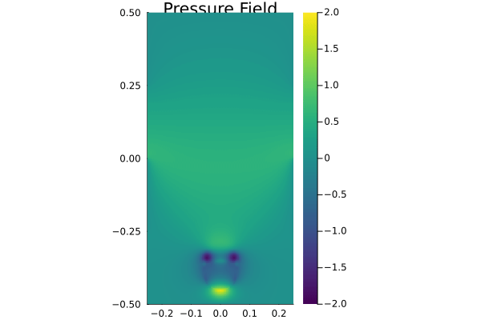

# Multi-xPU-3D-Navier-Stokes-Solver

[](https://github.com/BadeaTayea/Multi-xPU-3D-Navier-Stokes-Solver/actions/workflows/CI.yml)

[](https://github.com/BadeaTayea/Multi-xPU-3D-Navier-Stokes-Solver/actions/workflows/Literate.yml)


## Repository Guide

```bash
.
├── deps
│   └── build.jl
├── docs
│   ├── 2D_Pressure_Animation.gif
│   ├── 2D_Velocity_Animation.gif
│   ├── 2D_Vorticity_Animation.gif
│   ├── 3D_Pressure_Animation.gif
│   ├── 3D_Velocity_Animation.gif
│   ├── 3D_Vorticity_Animation.gif
│   └── md
│       └── Literate.md
├── Project.toml
├── README.md
├── scripts
│   ├── Literate.jl
│   ├── NavierStokes3D_multixpu.jl
│   ├── NavierStokes3D_xpu.jl
│   ├── Project.toml
│   ├── run_multixpu.sh
│   ├── run_xpu.sh
│   └── visualization
│       ├── NavierStokes_2D_Viz.jl
│       └── NavierStokes_3D_Viz.jl
└── test
    ├── NavierStokes3D_multixpu_testing.jl
    ├── out
    │   ├── A_out.bin
    │   ├── out_Pr_10.bin
    │   ├── out_Vx_10.bin
    │   ├── out_Vy_10.bin
    │   └── out_Vz_10.bin
    ├── out_ground_truth
    │   ├── out_Pr_10.bin
    │   ├── out_Vx_10.bin
    │   ├── out_Vy_10.bin
    │   └── out_Vz_10.bin
    ├── Project.toml
    └── runtests.jl
```

## Setups
All computations for this project were conducted on the supercomputer **Piz Daint** at CSCS. Piz Daint comprises approximately 5,700 compute nodes, each equipped with an Nvidia P100 GPU (16GB PCIe). To ensure a seamless workflow for computation and visualization, a few preparatory measures were implemented. Details are outlined below:

### Computational Setup
To run Julia interactively on Piz Daint, the following steps were followed:

1. Access Daint using the termina
```bash
$ ssh daint-xc
```

2. Allocate the desired configuration (xPU, nodes, processes, time) via SLURM:
```bash
$ salloc -C'gpu' -Aclass04 -N1 -n1 --time=01:00:00
```

3. Access Compute node:
```bash
$ . $SCRATCH/../julia/daint-gpu-nocudaaware/activate
```


4. Activate a previously prepared Julia configuration:
```bash
$ juliaup
```

### Visualization Setup

Visualization scripts rely on GLMakie. GLMakie requires OpenGL, which is unavailable in headless environments such as Piz Daint. As a walk-through, we set up a virtual display for headless rendering on Piz Daint, and then added the packages and ran the scripts. Here's a quick summary of the scheme used to create run visualization scripts:

1. Set up a virtual display for headless rendering on Piz Daint:
```bash
$ Xvfb :1 -screen 0 1024x768x24 &
$ export DISPLAY=:1
```

2. Confirm that Xvfb is running using:
```bash
$ ps aux | grep Xvfb
class203 12856  0.0  0.0 2389004 43516 pts/0   Sl   10:00   0:00 Xvfb :1 -screen 0 1024x768x24
```

3. Enter julia REPL and activate a local project:
```julia
julia> using Pkg
julia> Pkg.activate()
julia> Pkg.instantiate()
```

4. Re-install the GLMakie package within the environment:
  ```julia
  Pkg.add("GLMakie")
  ```
  
5. Run the script relying on GLMakie (e.g. `./scripts/visualization/NavierStokes_3D_Viz.jl`):
```julia
julia> include("NavierStokes_3D_Viz.jl")
```


## Physical Problem 
### Governing System of Partial Differential Equations (PDEs)
### Boundary Conditions

## Numerical Methods

## xPU Computing
### xPU Implementation 
### Multi-xPU Implementation

## Visualization: Velocity, Vorticity, and Pressure Fields

### Cross-Sectional Evolution in 2D 

<table>
  <tr>
    <td align="center">
      <strong>Velocity Field</strong><br>
      
    </td>
    <td align="center">
      <strong>Vorticity Field</strong><br>
      
    </td>
    <td align="center">
      <strong>Pressure Field</strong><br>
      
    </td>
  </tr>
  <tr>
    <td align="center">
      <strong>Fig. 1:</strong> 2D Velocity Field - Evolution of velocity magnitude.
    </td>
    <td align="center">
      <strong>Fig. 2:</strong> 2D Vorticity Field - Evolution of rotational flow.
    </td>
    <td align="center">
      <strong>Fig. 3:</strong> 2D Pressure Field - Evolution of pressure distribution.
    </td>
  </tr>
</table>

### Evolution in 3D 

<table>
  <tr>
    <td align="center">
      <strong>Velocity Field</strong><br>
      
    </td>
    <td align="center">
      <strong>Vorticity Field</strong><br>
      
    </td>
    <td align="center">
      <strong>Pressure Field</strong><br>
      
    </td>
  </tr>
  <tr>
    <td align="center">
      <strong>Fig. 4:</strong> 3D Velocity Field - Evolution of velocity magnitude.
    </td>
    <td align="center">
      <strong>Fig. 5:</strong> 3D Vorticity Field - Evolution of rotational flow structures.
    </td>
    <td align="center">
      <strong>Fig. 6:</strong> 3D Pressure Field - Evolution of pressure distribution in 3D.
    </td>
  </tr>
</table>

## Resources
